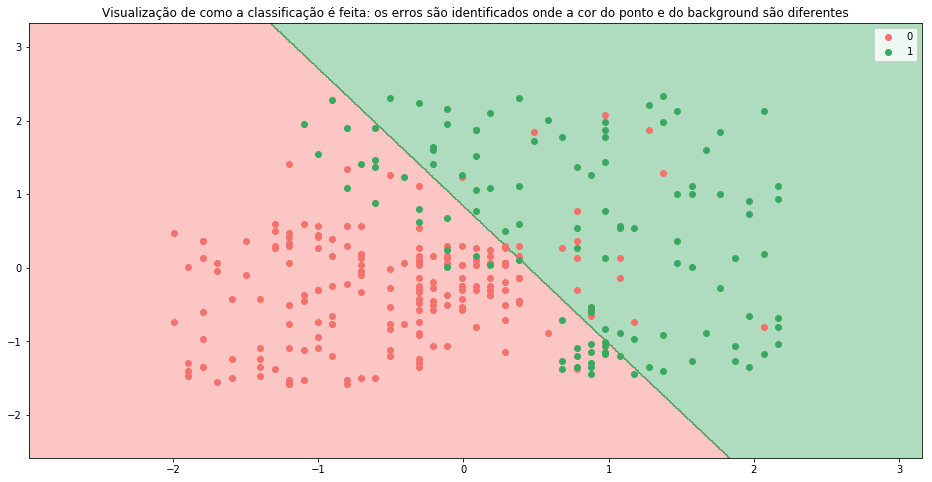
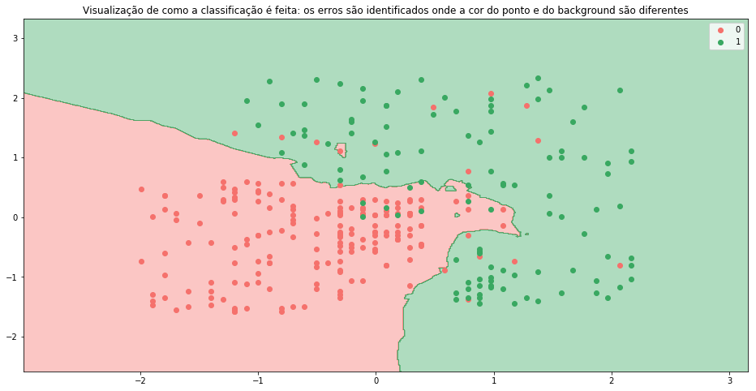
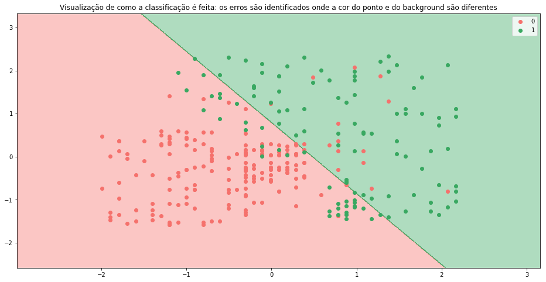
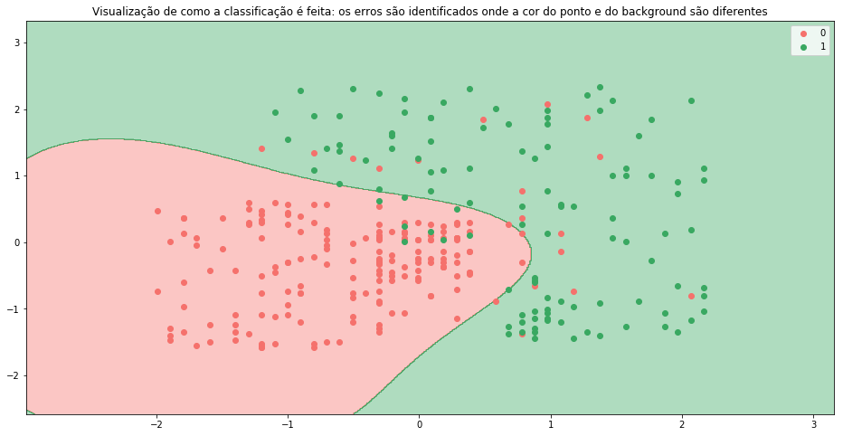
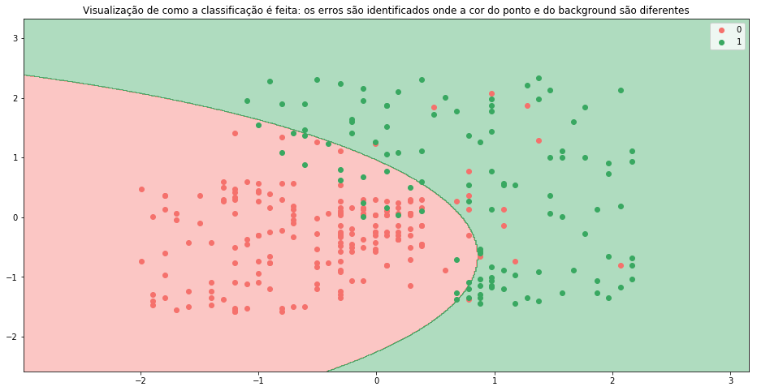
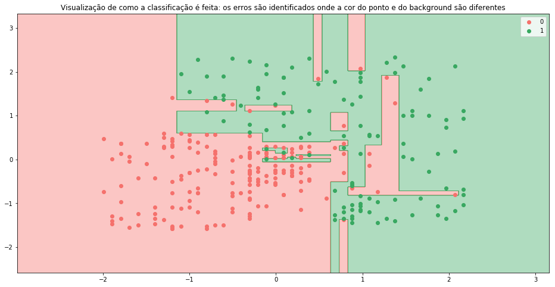
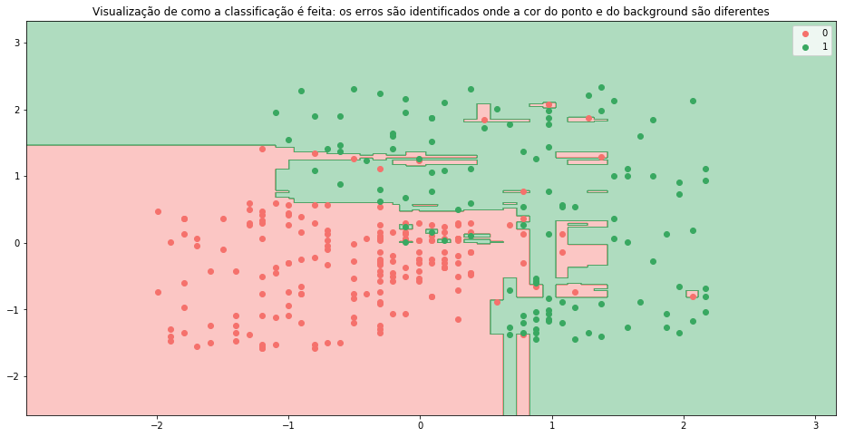

# Machine Learning: Algoritmos de classificação
- Regressão Logística
- K-NN
- SVM
- Kernel SVM
- Naive Bayes
- Decision Tree
- Random Forest

### Preprocessamento do dataset


```python
import pandas as pd
import numpy as np
import matplotlib.pyplot as plt

dataset = pd.read_csv('Social_Network_Ads.csv')
X = dataset.iloc[:, [2, 3]].values # feature matrix
y = dataset.iloc[:, 4].values # variavel dependente (classes, nesse caso 0 ou 1)

# divisao entre dataset de treino e teste
from sklearn.model_selection import train_test_split
X_train, X_test, y_train, y_test = train_test_split(X, y, test_size = .25, random_state = 0)

# padronizacao dos valores
from sklearn.preprocessing import StandardScaler
sc = StandardScaler()
X_train = sc.fit_transform(X_train)
X_test = sc.transform(X_test)
```

    /home/alexandre/anaconda3/envs/tensorflow/lib/python3.5/site-packages/sklearn/utils/validation.py:475: DataConversionWarning: Data with input dtype int64 was converted to float64 by StandardScaler.
      warnings.warn(msg, DataConversionWarning)


### Funções úteis para validação dos classificadores


```python
# Thx for Hadelin from SuperDataScience Team for this function!
def classification_view(X_train, y_train, classifier):
    from matplotlib.colors import ListedColormap
    X_set, y_set = X_train, y_train
    X1, X2 = np.meshgrid(np.arange(start = X_set[:, 0].min() - 1, stop = X_set[:, 0].max() + 1, step = 0.01),
                         np.arange(start = X_set[:, 1].min() - 1, stop = X_set[:, 1].max() + 1, step = 0.01))
    plt.figure(figsize=(16,8))
    plt.contourf(X1, X2, classifier.predict(np.array([X1.ravel(), X2.ravel()]).T).reshape(X1.shape),
                 alpha = 0.4, cmap = ListedColormap(('#F5716C', '#39A861')))
    plt.xlim(X1.min(), X1.max())
    plt.ylim(X2.min(), X2.max())
    for i, j in enumerate(np.unique(y_set)):
        plt.scatter(X_set[y_set == j, 0], X_set[y_set == j, 1],
                    c = ListedColormap(('#F5716C', '#39A861'))(i), label = j)
    plt.title('Visualização de como a classificação é feita: os erros são identificados onde a cor do ponto e do background são diferentes')
    plt.legend()
    plt.show()

def accuracy(confusion_matrix):
    sum, total = 0,0
    for i in range(len(confusion_matrix)):
        for j in range(len(confusion_matrix[0])):
            if i == j: 
                sum += confusion_matrix[i,j]
            total += confusion_matrix[i,j]
    return sum/total
```

### Regressão logística
http://scikit-learn.org/stable/modules/generated/sklearn.linear_model.LogisticRegression.html}


```python
from sklearn.linear_model import LogisticRegression
lr_classifier = LogisticRegression()
lr_classifier.fit(X_train, y_train)
y_pred = lr_classifier.predict(X_test)

from sklearn.metrics import confusion_matrix
reg_cm = confusion_matrix(y_pred, y_test)

print('matriz de confusão:')
print(reg_cm,'\n')
print('acurácia: ',accuracy(reg_cm)*100,'%')
classification_view(X_train, y_train, lr_classifier)
```

    matriz de confusão:
    [[65  8]
     [ 3 24]] 
    
    acurácia:  89.0 %





### K-Nearest Neighbors
http://scikit-learn.org/stable/modules/generated/sklearn.neighbors.KNeighborsClassifier.html


```python
from sklearn.neighbors import KNeighborsClassifier
knn_classifier = KNeighborsClassifier()
knn_classifier.fit(X_train, y_train)
y_pred = knn_classifier.predict(X_test)

knn_cm = confusion_matrix(y_pred, y_test)

print('matriz de confusão:')
print(knn_cm,'\n')
print('acurácia: ',accuracy(knn_cm)*100,'%')
classification_view(X_train, y_train, knn_classifier)
```

    matriz de confusão:
    [[64  3]
     [ 4 29]] 
    
    acurácia:  93.0 %





### Support Vector Machines Classifier
http://scikit-learn.org/stable/modules/generated/sklearn.svm.SVC.html


```python
from sklearn.svm import SVC
svm_classifier = SVC(kernel = 'linear')
svm_classifier.fit(X_train, y_train)
y_pred = svm_classifier.predict(X_test)

svm_cm = confusion_matrix(y_pred, y_test)

print('matriz de confusão:')
print(svm_cm, '\n')
print('acurácia: ',accuracy(svm_cm)*100, '%')
classification_view(X_train, y_train, svm_classifier)
```

    matriz de confusão:
    [[66  8]
     [ 2 24]] 
    
    acurácia:  90.0 %





### Support Vector Classifier com Kernel "Gaussiano" (rbf)


```python
svm_classifier = SVC(kernel = 'rbf')
svm_classifier.fit(X_train, y_train)
y_pred = svm_classifier.predict(X_test)

svm_cm = confusion_matrix(y_pred, y_test)

print('matriz de confusão:')
print(svm_cm,'\n')
print('acurácia: ',accuracy(svm_cm)*100, '%')
classification_view(X_train, y_train, svm_classifier)
```

    matriz de confusão:
    [[64  3]
     [ 4 29]] 
    
    acurácia:  93.0 %





### Naive Bayes
http://scikit-learn.org/stable/modules/generated/sklearn.naive_bayes.GaussianNB.html


```python
from sklearn.naive_bayes import GaussianNB
nb_classifier = GaussianNB()
nb_classifier.fit(X_train, y_train)
y_pred = nb_classifier.predict(X_test)

nb_cm = confusion_matrix(y_pred, y_test)

print('matriz de confusão:')
print(nb_cm,'\n')
print('acurácia: ',accuracy(nb_cm)*100, '%')
classification_view(X_train, y_train, nb_classifier)
```

    matriz de confusão:
    [[65  7]
     [ 3 25]] 
    
    acurácia:  90.0 %





# Decision Tree Classifier
http://scikit-learn.org/stable/modules/generated/sklearn.tree.DecisionTreeClassifier.html


```python
from sklearn.tree import DecisionTreeClassifier
tree_classifier = DecisionTreeClassifier()
tree_classifier.fit(X_train, y_train)
y_pred = tree_classifier.predict(X_test)

tree_cm = confusion_matrix(y_pred, y_test)

print('matriz de confusão:')
print(tree_cm,'\n')
print('acurácia: ',accuracy(tree_cm)*100, '%')
classification_view(X_train, y_train, tree_classifier)
```

    matriz de confusão:
    [[62  4]
     [ 6 28]] 
    
    acurácia:  90.0 %





# Random Forest Classifier
http://scikit-learn.org/stable/modules/generated/sklearn.ensemble.RandomForestClassifier.html


```python
from sklearn.ensemble import RandomForestClassifier
rf_classifier = RandomForestClassifier(n_estimators = 10, criterion = 'entropy')
rf_classifier.fit(X_train, y_train)
y_pred = rf_classifier.predict(X_test)

rf_cm = confusion_matrix(y_pred, y_test)

print('matriz de confusão:')
print(rf_cm,'\n')
print('acurácia: ',accuracy(rf_cm)*100, '%')
classification_view(X_train, y_train, rf_classifier)
```

    matriz de confusão:
    [[64  2]
     [ 4 30]] 
    
    acurácia:  94.0 %




